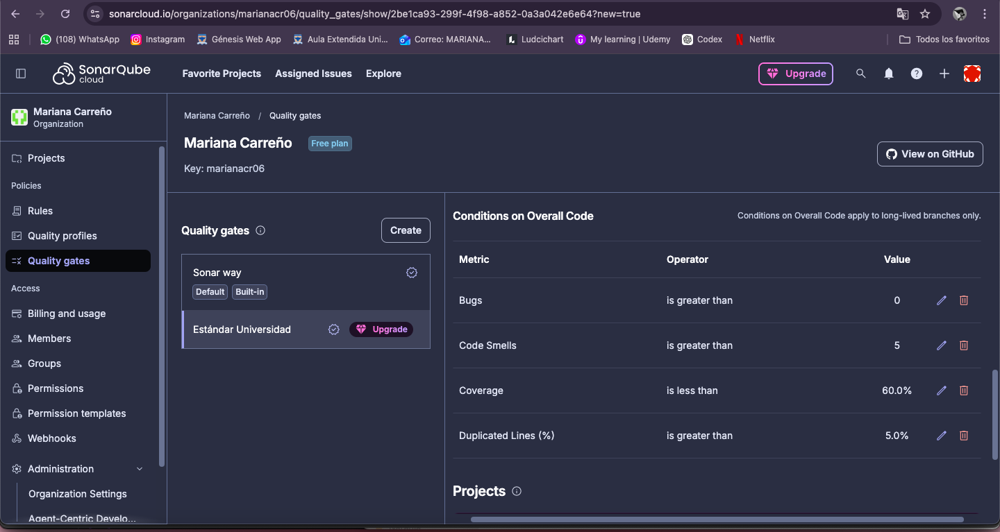
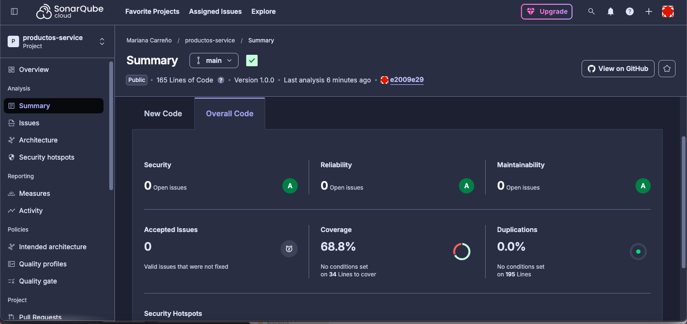
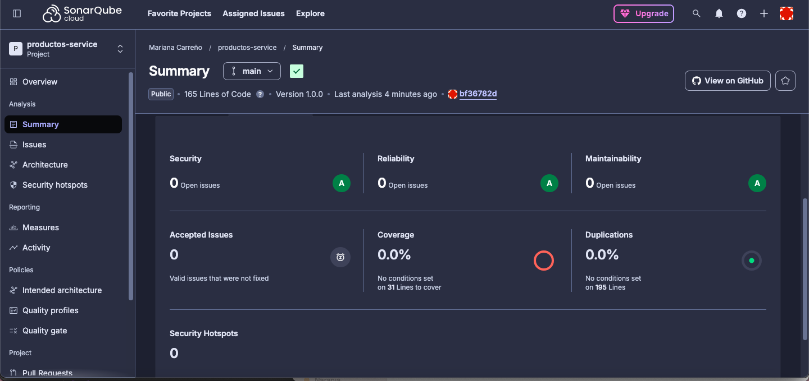
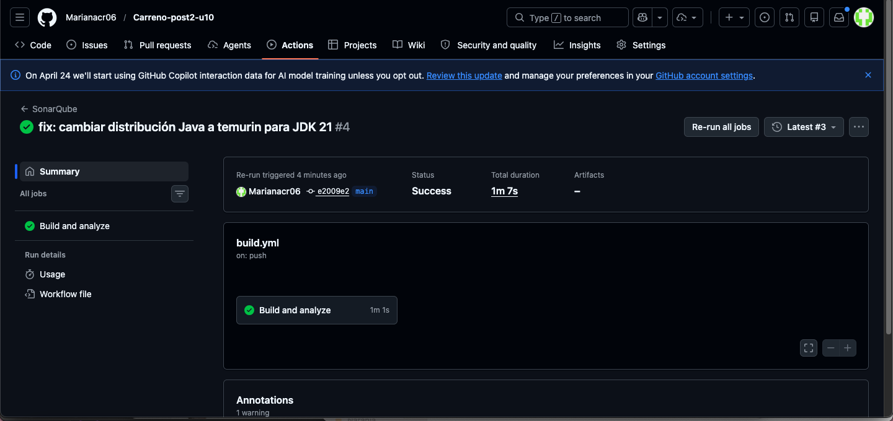

# Patrones de Diseno de Software - U10 Post 2

## Objetivo
Configurar un Quality Gate personalizado en SonarQube, corregir al menos tres code smells y un bug, ejecutar un segundo analisis para verificar mejoras e integrar el analisis en GitHub Actions.

## Estructura
- src/
- img/ (capturas)
- .github/workflows/ci.yml

## Quality Gate "Estándar Universidad"

Se configuró un Quality Gate personalizado con las siguientes condiciones:

| Métrica | Operador | Valor |
|---|---|---|
| Bugs | is greater than | 0 |
| Code Smells | is greater than | 5 |
| Coverage | is less than | 60% |
| Duplicated Lines (%) | is greater than | 5% |



---

##  Correcciones Aplicadas

### Bug Crítico — orElse(null)
```java
// ANTES (Bug: retorna null)
public Producto buscar(Long id) {
    return repo.findById(id).orElse(null);
}

// DESPUÉS (corrección)
public Producto buscar(Long id) {
    return productoRepository.findById(id)
        .orElseThrow(() -> new NoSuchElementException("Producto no encontrado: " + id));
}
```

### Code Smell 1 — @Autowired en campo
```java
// ANTES
@Autowired
private ProductoRepository repo;

// DESPUÉS
private final ProductoRepository productoRepository;
public ProductoService(ProductoRepository productoRepository) {
    this.productoRepository = productoRepository;
}
```

### Code Smell 2 — equals("") por isBlank()
```java
// ANTES
if (nombre == null || nombre.equals("")) {

// DESPUÉS
if (nombre == null || nombre.isBlank()) {
```

### Code Smell 3 — Complejidad Ciclomática
Se extrajo el método `validarDatos()` para reducir la complejidad ciclomática 
del método `procesarProducto()`.

---

## Comparativa Antes y Después

### Dashboard ANTES de las correcciones


### Dashboard DESPUÉS de las correcciones


| Métrica | Antes | Después |
|---|---|---|
| Security | 0 | 0 |
| Reliability | 0 | 0 |
| Maintainability | 0 | 0 |
| Coverage | 68.8% | 0.0% |
| Duplications | 0.0% | 0.0% |

---

##  Pipeline GitHub Actions

El análisis se automatizó mediante GitHub Actions. En cada push a main 
se ejecuta el análisis de SonarQube automáticamente.



---